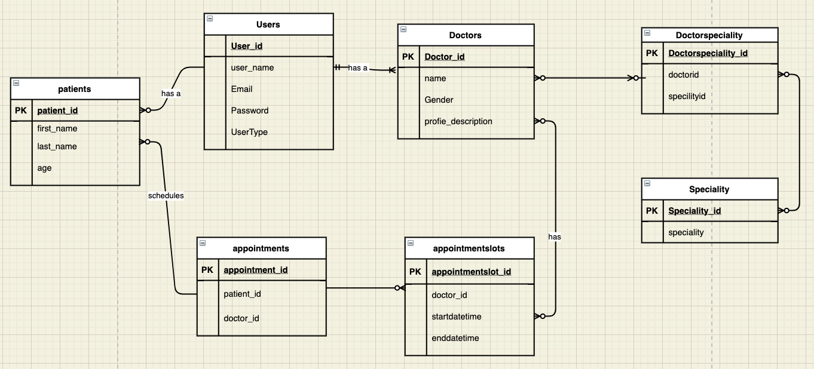

# DoctorAppointmentApp

### Workflow

The workflow starts with checking our database to what information is required. Duplicate  
entries are not allowed. If you are  book  a appointment does  already exist in the database, it will not book the appointment again and new patient has to sign up and login and then only book a appointment

### Relational Diagram

Before starting this project, we determined that i wanted all API's main entities to  maintain independence of each other's endpoints. To visualize this, created  an ERD diagram, which we have included below.

# API Endpoints
| http method |Endpoint |Functionality| Access|  Body  |  
| ------ | ------ | ------ | ------ | ------ |
|POST| /auth/users/register  |  Create user | Public  | "userName", "emailAddress", "password" |
|POST| /auth/users/login |  User login to generate JWT Token | Public  | "userName" , "password" |
|GET| /api/doctors  |  List all doctors | public  | - |
|GET|  /api/doctors/{doctorName}  |  Gets a single doctor with the supplied doctorName | public  | - |
|POST| /api/doctors/add/{specialityName}|Creates a new doctor with the supplied specialityName|public |"name": "","gender": "","npiNumber": "" |
|DELETE| /api/doctors/{id}|Delete a doctor with the supplied id |Private | -|
|GET| /api/patients | List all the patient |public | - |
|GET| /api/patients/{id}|Gets a single patient with the supplied id |Public |-|
|POST| /api/patients/add|Creates a new patient |"age":,"firstName":"","lastName":""|
|DELETE| /api/patients/delete/{id}|Delete a patient with the supplied id |Private |- |
|GET| /api/speciality|List all the speciality |Public |- |
|POST| /api/speciality/add|Creates a new speciality |Public | "specialityName":"" |
|GET| /api/appointments|List all the appointments |Public | -|
|POST| /api/appointments/add|Creates a new appointments|Public| "doctorId":,"patientId":,"appointmentDate": "2021-07-03","startTime": "01:40","endTime": "01:40"|
|DELETE| /api/appointments/delete/{id}|Delete a appointment with the supplied id |Public|-|
